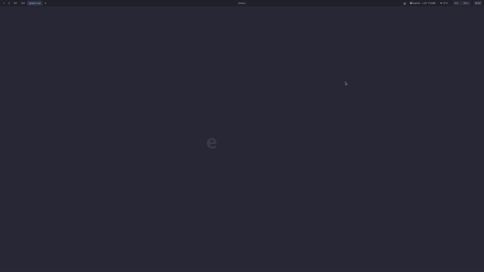

<p align="center">
  
</p>

# emskin

> 给 Emacs 加上皮肤 — Dress Emacs in a Wayland skin.

[English](README.md)

emskin 把 Emacs 放进一个 Wayland 合成器里，让**任意程序**（浏览器、终端、视频播放器等）都能像原生 buffer 一样嵌入 Emacs 窗口。



## 特性

- **任意程序嵌入** — Wayland 和 X11 程序均可嵌入
- **窗口镜像** — 同一程序显示在多个 Emacs 窗口
- **输入法支持** — 共用宿主输入法，输入法精确定位
- **剪贴板同步** — 主机与嵌入程序双向同步
- **启动器支持** — rofi / wofi 等可直接使用
- **自动焦点管理** — 新窗口自动获焦，关闭后自动回退

## 兼容性

| 桌面环境 | Wayland | X11 |
|----------|---------|-----|
| GNOME    | ✓       | ✓   |
| KDE      | ✓       | ✓   |
| Sway     | ✓       | —   |
| COSMIC   | ✓       | —   |

推荐 pgtk Emacs（`--with-pgtk`），GTK3 X11 版本亦可通过 XWayland 运行。

## 安装

**需要 Rust ≥ 1.89**（`rust-toolchain.toml` 固定为 1.92.0）。如果发行版自带的 rustc 版本较旧，请通过 [rustup](https://rustup.rs/) 安装：

```bash
curl --proto '=https' --tlsv1.2 -sSf https://sh.rustup.rs | sh
```

### Arch Linux (AUR)

```bash
yay -S emskin-bin
```

### 从源码构建

```bash
# 安装依赖（Arch Linux）
sudo pacman -S wayland libxkbcommon mesa

# 方式一：cargo install
cargo install --git https://github.com/emskin/emskin.git

# 方式二：手动编译
git clone https://github.com/emskin/emskin.git
cd emskin && cargo build --release
```

## 快速开始

```bash
# 零配置体验（自动加载内置 elisp，无需任何 Emacs 配置）
emskin --standalone
```

## 使用

### 打开嵌入程序

在 emskin 内的 Emacs 中：

```
M-x emskin-open-native-app RET firefox
M-x emskin-open-native-app RET foot
```

程序会自动嵌入当前 Emacs 窗口，并获得键盘焦点。

### 键盘交互

嵌入程序获焦时，键盘输入直接发送给它。Emacs 前缀键（`C-x`、`C-c`、`M-x`）会被自动拦截并送回 Emacs，完成组合键后焦点自动恢复。

- `C-x o` — 切换 Emacs 窗口（嵌入程序随 buffer 切换自动获焦）
- `C-x 1` / `C-x 2` / `C-x 3` — 正常的窗口操作，嵌入程序自动调整大小

### 工作区

每个 Emacs frame 对应一个工作区：

- `C-x 5 2` — 新建工作区
- `C-x 5 o` — 切换工作区
- `C-x 5 0` — 关闭当前工作区

### 使用启动器

绑定快捷键启动 zofi / rofi 等启动器：

```elisp
;; zofi — 专为 emskin 设计的启动器，见 https://github.com/emskin/zskins
(defun my/emskin-zofi ()
  (interactive)
  (start-process "zofi" nil "setsid" "zofi"))
(global-set-key (kbd "C-c z") #'my/emskin-zofi)

;; rofi
(defun my/emskin-rofi ()
  (interactive)
  (start-process "rofi" nil
                 "setsid" "rofi"
                 "-show" "combi"
                 "-combi-modi" "drun,ssh"
                 "-terminal" "foot"
                 "-show-icons" "-i"))
(global-set-key (kbd "C-c r") #'my/emskin-rofi)
```

## Emacs 配置

不使用 `--standalone` 时，需要手动加载 elisp：

```elisp
(add-to-list 'load-path "/path/to/emskin/elisp")
(require 'emskin)
```

## CLI 参数

```
emskin [OPTIONS]

  --standalone            独立模式，自动加载内置 elisp（推荐初次体验）
  --no-spawn              不启动 Emacs，等待外部连接
  --command <CMD>         启动命令 (默认: "emacs")
  --arg <ARG>             命令参数 (可多次指定)
  --bar <MODE>            工作区栏: "builtin" (默认) 或 "none"
  --xkb-layout <LAYOUT>   键盘布局 (例: "us", "cn")
```

## FAQ

### 虚拟机里启动后闪退

emskin 支持软件渲染（llvmpipe），但旧版本 Mesa（< 21.0）在高分辨率下可能崩溃。解决方法：

```bash
# 检查当前渲染器
glxinfo | grep "OpenGL renderer"

# 如果显示 llvmpipe 且分辨率过高，降低分辨率
xrandr --output Virtual-1 --mode 1920x1080
```

确保安装了 mesa：`sudo pacman -S mesa mesa-utils`（Arch）或 `sudo apt install mesa-utils`（Debian/Ubuntu）。

## 致谢

基于 [Smithay](https://github.com/Smithay/smithay) 构建 — Rust 实现的 Wayland 合成器库。

## License

GPL-3.0
